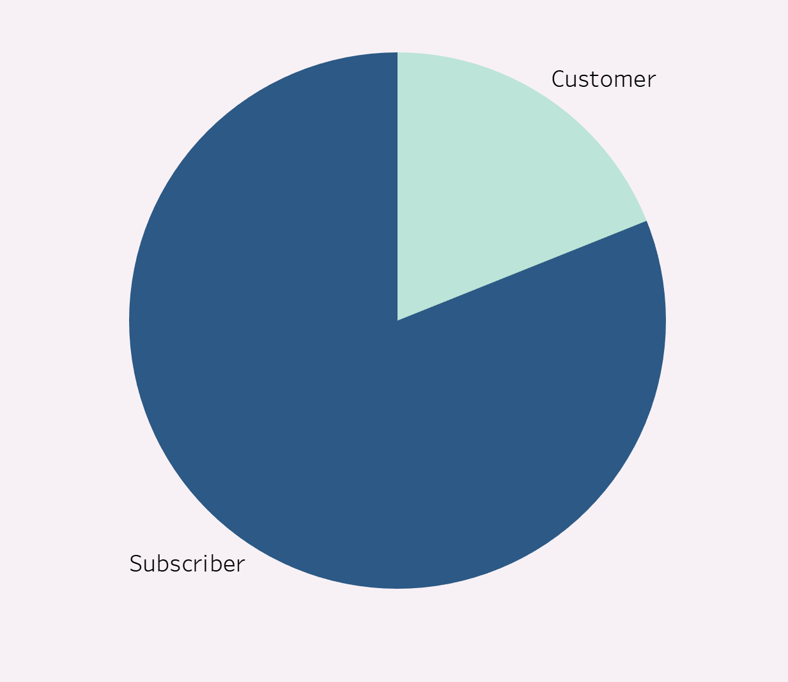
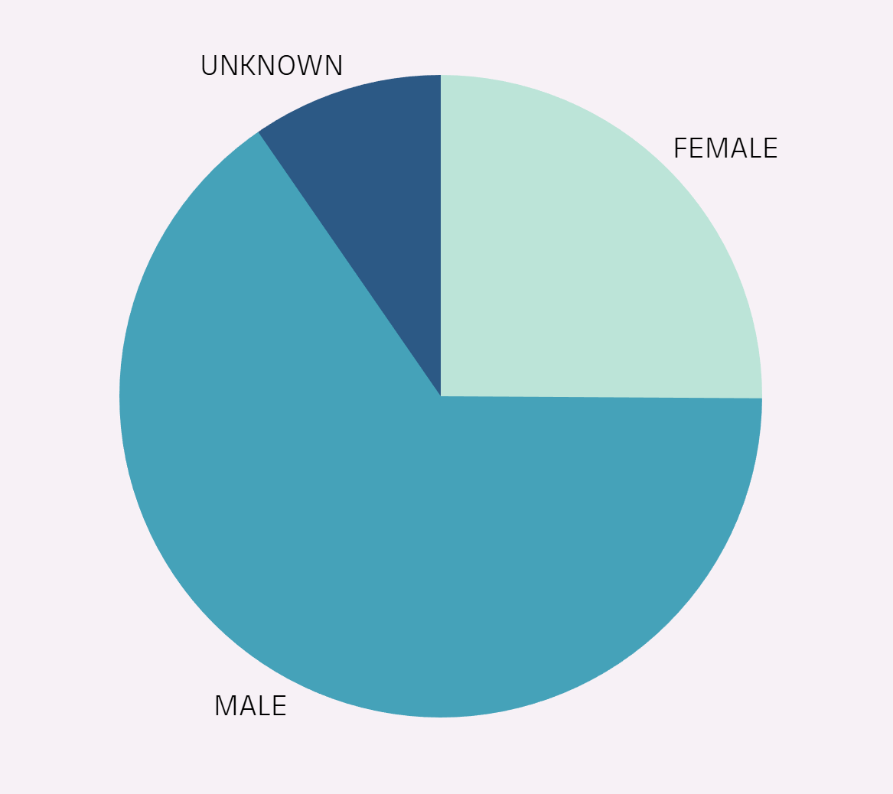
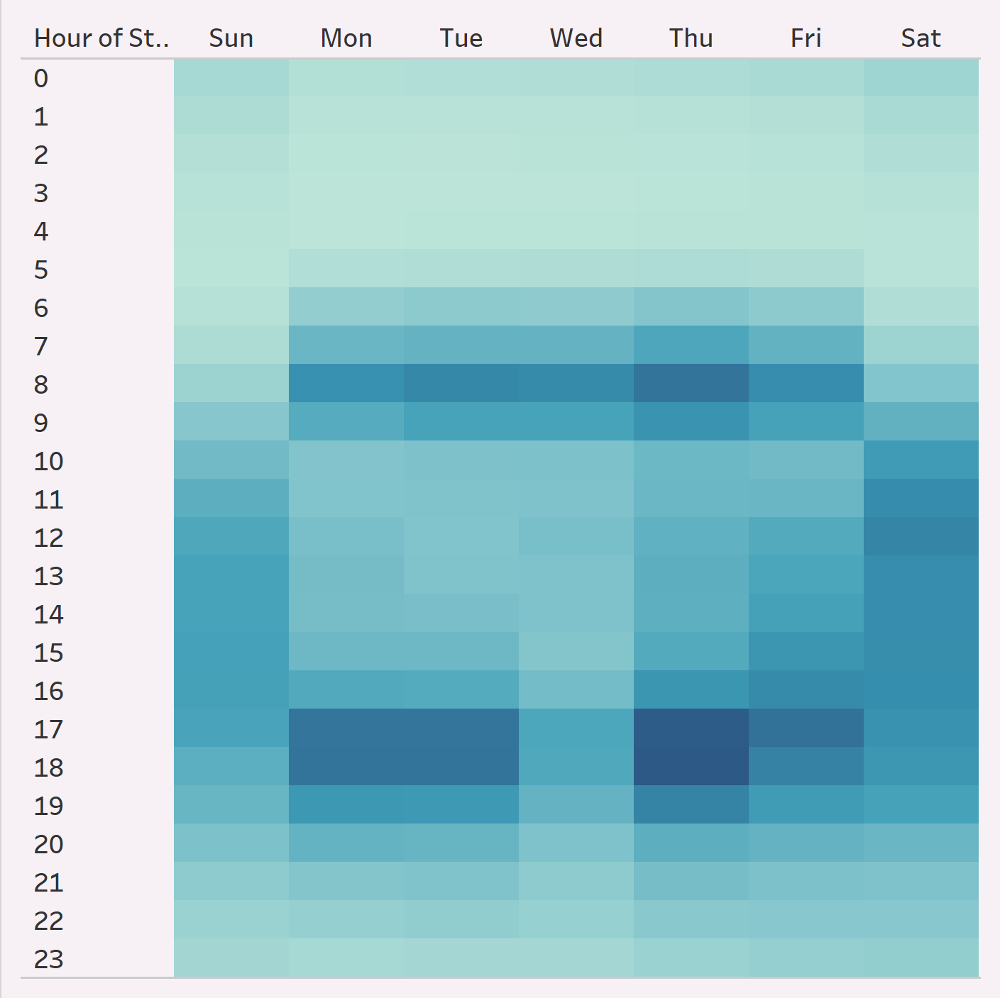
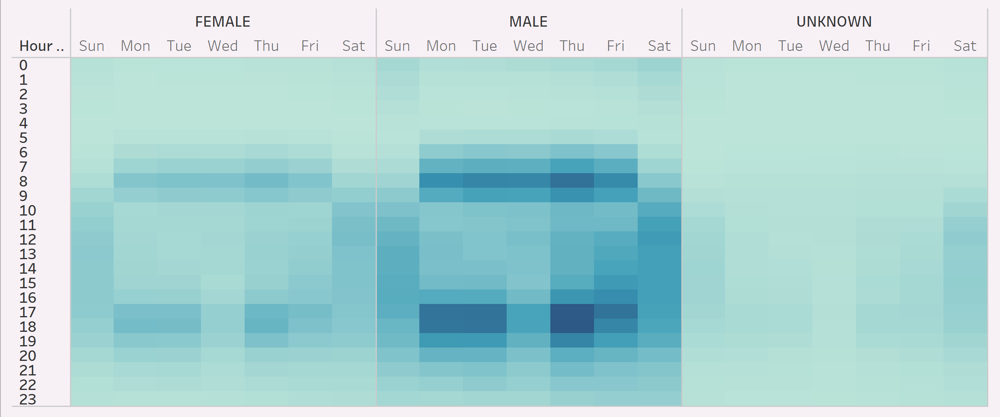
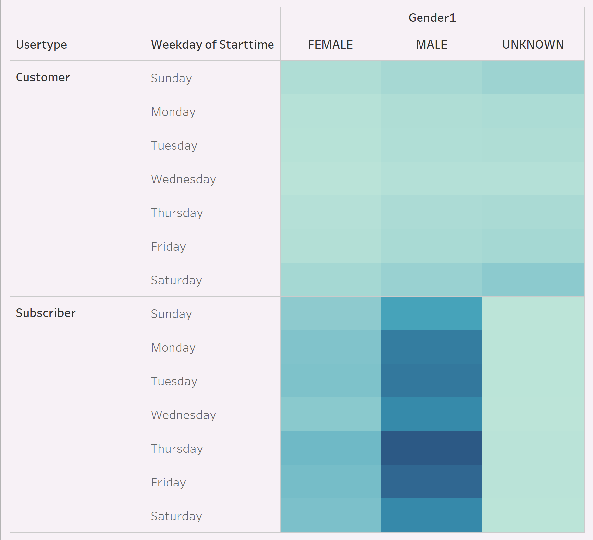
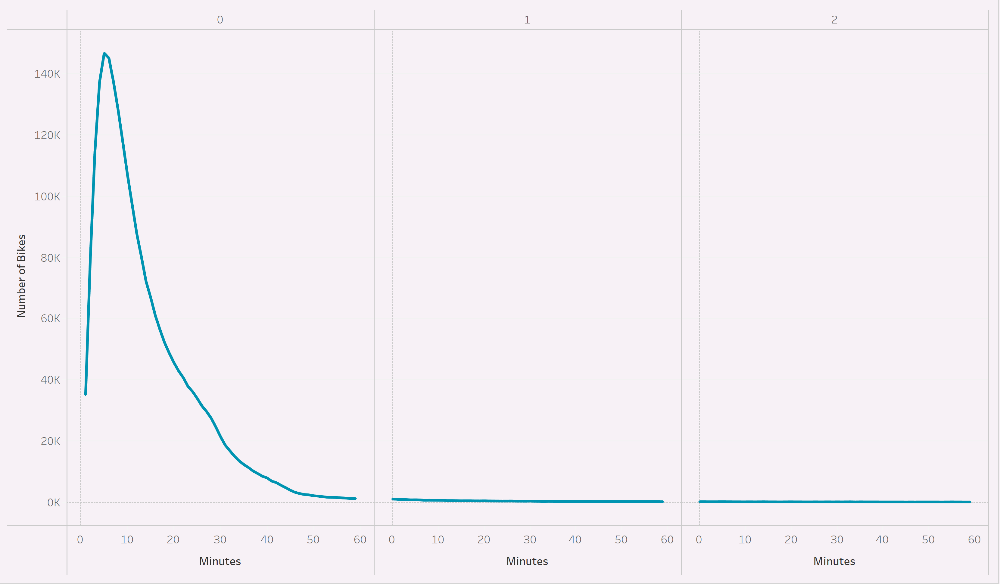
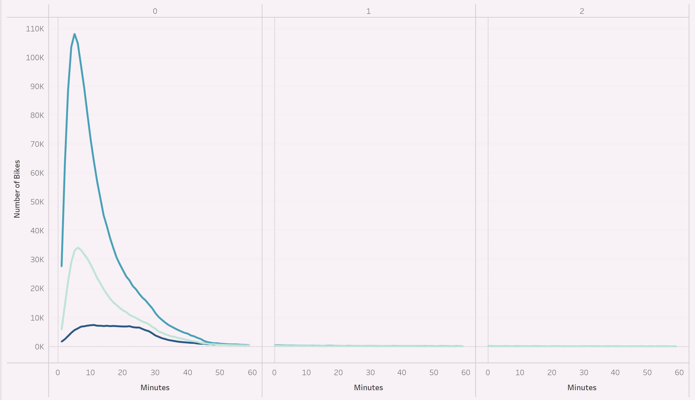
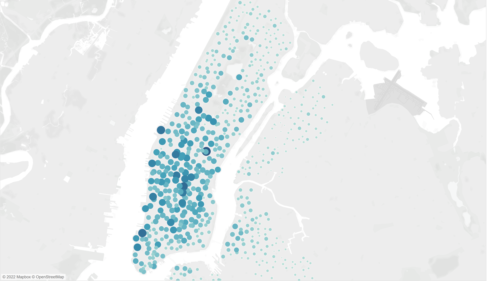
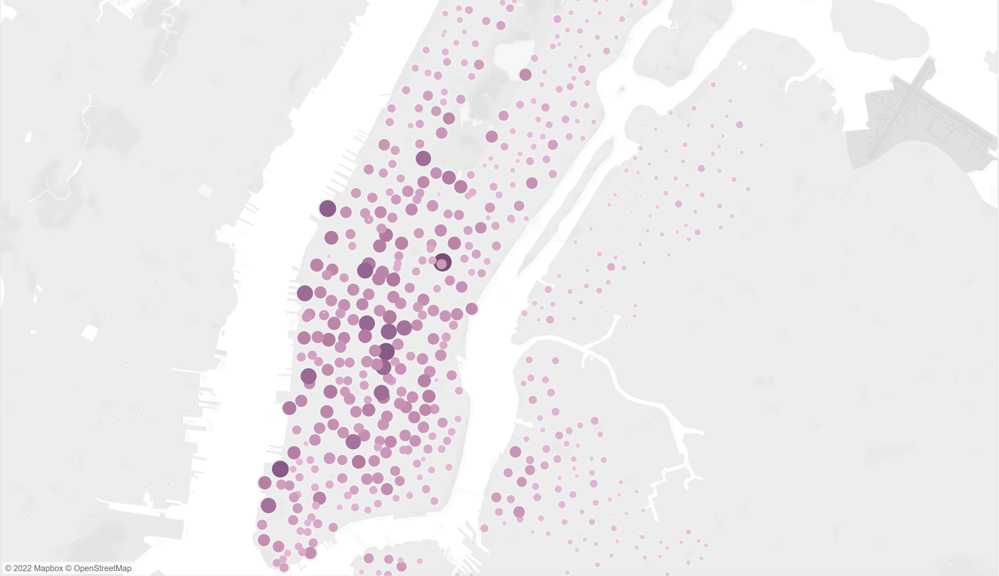

# CitiBike
## Overview of Project
This project was completed as part of a business proposal to bring a bike sharing program to Des Moines. The data used for this project is from a bike sharing company called CitiBike in New York City. First, the makeup of the CitiBike users was analyzed. Next, characteristics of the bike trips were analyzed. The results are intended to be used to inform potential investors of what a bike sharing program in Des Moines might look like. The visualizations of these analyses can be found at the following link: [CitiBike Visualizations](https://public.tableau.com/shared/J4BMFH26Y?:display_count=n&:origin=viz_share_link)

## Results
### Who uses CitiBike?
**User Types**   

The majority of the users of CitiBike are subscribers rather than short term customers. 

**User Genders**  
  
The majority of the users of CitiBike identify as male, followed by female, and then unknown.  

### When do they use it? 
**Trips by Weekday per Hour**   
  
During the weekends, the bikes are more frequently used during the middle of the day. However, during the work week, the bikes are more frequently used around 8am and 5-6pm. 

**Trips by Gender (Weekday per Hour)**  
  
Females and males follow the same overall as discussed above. However, it appears that users whose genders are unknown may use the bikes more on the weekend rather than during the week.   

**User Trips by Gender by Weekday**
  
From this chart, it appears that short term customers are more likely to use the bikes on the weekend, while subscribers are more likely to use them during the work week. 

### How long do they use it?  
**Checkout Times for Users**
  
The majority of bike checkouts last less than one hour, but more frequently they only last 5-6 minutes. 

**Checkout Times by Gender** 
  
Males and females seem to both follow a similar pattern where the most frequent length of checkout was 5-6 minutes. However, users whose gender is unknown seem to exhibit a flatter curve where the most frequent length was around 11 minutes.  

### Where are they going?
**Top Starting Locations**    

Based on the size and darkness of the markers on the map, the majority of starting locations for the bike rides are concentrated in a specific area, and become less frequent as one moves away from this area.  

**Top Ending Locations**   
  
Based on the size and darkness of the markers on the map, the majority of ending locations for the bike rides are concentrated in the same general area as the top starting locations, and become less frequent as one moves away from this area.   

## Summary
The majority of CitiBike users are male and subcribe to the service. 

During the work week, the majority of bike trips happen around typical work commute times, and subscribers are more likely to use the bikes during the work week. This indicates that subscribers are probably using CitiBike as their daily transportation to and from work. 

On the weekends, the bikes are mainly used from about 10am to 6pm, and short term customers are more likely to use the bikes during the weekend rather than the work week. This indicates that short term customers are likely visitors to the city who are using the bikes to sightsee. 

The majority of bike rides are very short. This is evidenced not only by the checkout times, but by the top starting and ending locations being similar. Users are mainly using the bikes to travel short distances within a city center which likely has many businesses and tourist locations.  

In the future, it may be benficial to examine the top starting and ending locations with regards to each user type. For example, the markers on a map could vary in color based on the customer/subscriber makeup for rides for that location. It may be possible that the locations farther out are being used by subscribers who live further away and are traveling to work on bicycle to avoid traffic. It would also be interesting to visualize the top starting and ending locations for the work week versus weekends. The spread of the locations may be smaller on the weekend when more individuals are driving into the city and just using the bikes to sightsee rather than as actual transportation.